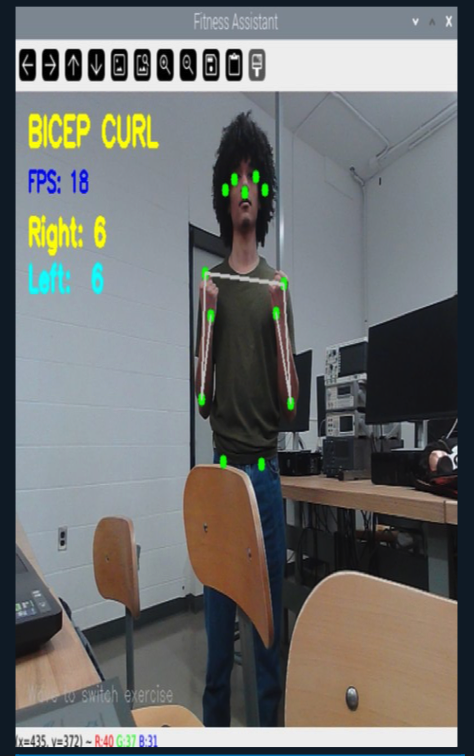
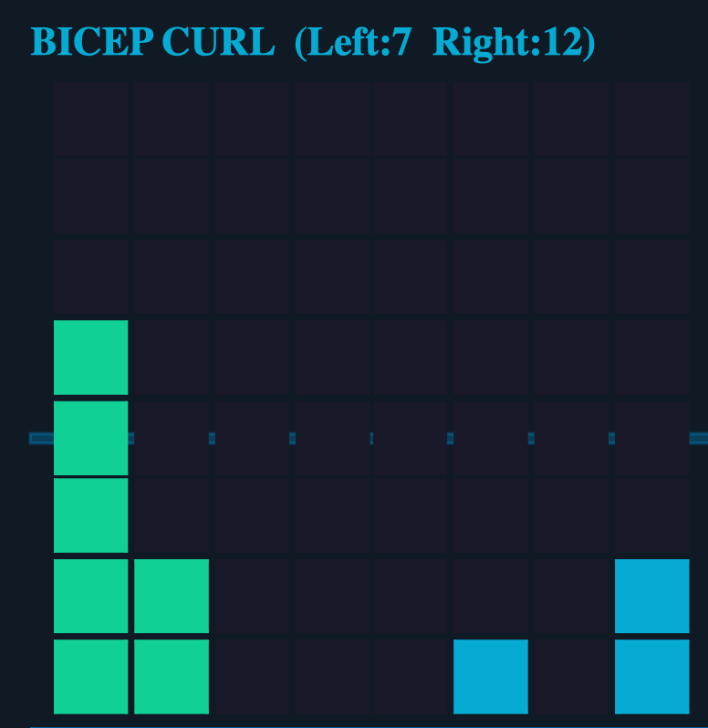

# Exercise  Tracker
An exercise tracker utilizing Coral TPU, Google Gemini and Speech Recognition.

## Available workouts
- Bicep Curls
- Shoulder Press

## Build

```bash
pyinstaller --noconsole \
  --add-data "movenet_single_pose_lightning_ptq_edgetpu.tflite:." \
  --add-data "movenet_single_pose_lightning_ptq.tflite:." \
  --add-data "/usr/lib/python3/dist-packages/sense_hat:sense_hat" \
  --name GainsPi main.py
```

## Usage
 To change work out do the motion or say the workout.

# Examples



*Using computer vision the pi is able to keep track of movements*



*SenseHat used to keep track of reps as well as display additional information*
